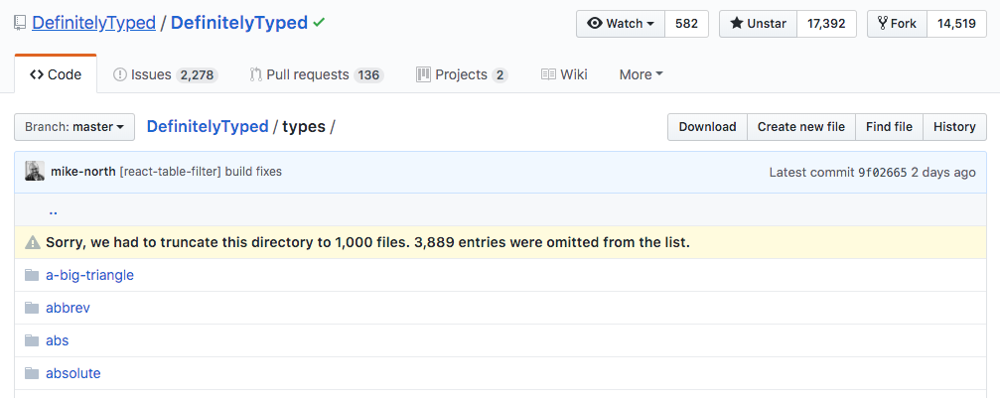
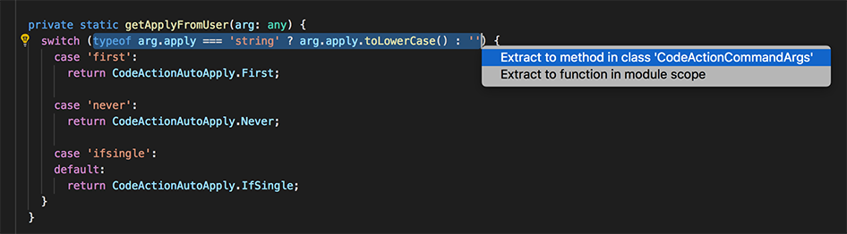

import { Head, Image } from 'mdx-deck'
import { SplitRight } from 'mdx-deck/layouts'
import Code from './Code';

export { default as theme } from './theme'

<Head>
  <title>Hello TypeScript!</title>

  <meta name='twitter:card' content='summary' />
  <meta name='twitter:site' content='@sebastiansebald' />
  <meta property='og:title' content='Hello TypeScript' />
  <meta property='og:description' content='A talk about the awesomeness of TypeScript!' />
  <meta property="og:url" content="https://sebald.github.io/hello-typescript/" />

  <link rel="shortcut icon" href="assets/fav.png"/>
</Head>

<Image 
  src="assets/deck.png"
  style={{
    display: 'flex',
    justifyContent: 'center',
    alignItems: 'center',
    backgroundSize: 'auto',
    backgroundRepeat: 'repeat',
  }}
>
  <h1 style={{
    fontSize: '3em',
  }}>Hello TypeScript</h1>
</Image>

---

## What is TypeScript?

---

> [..], it basically formalizes a **static type system** that describes JavaScript's dynamic types, but it describes them **at development time**.
>
> *- Anders Hejlsberg*

---

Makes **implicit** types **explicit**.

---


---

## Why should I care?

---


---


---

- JavaScript, built for scale™️ 
- ECMAScript Stage 3 + JSX
- Static types helps catch mistakes & bugs earlier
- Refactor with confidence
- Works well with existing projects

```notes
- Configuration (strictness, target, non-nullable check, ...)
- Tooling (Intellisense, auto import, ...)
- Reafactoring (rename, extract function, ...)
- non-nullable type checking
- JSX support
```

---

## Type System

---

<Code
  title="Type System"
  code={require("!raw-loader!./demo/type-system.ts")}
  steps={[
    { range: [1, 2], notes: 'Type Inference' },
    { range: [3, 6], notes: 'Function signature' },
    { range: [8, 10], notes: 'Generics' },
    { range: [12, 19], notes: 'Interfaces' },
    { range: [21, 22], notes: 'Escape hatch' },
  ]}
/>

---


```notes
That's the boring part!
```

---

## Why TypeScript is awesome!

- Structural Typing (unsound)
- Supports OOP + FP
- Extensive Type Inference
- Control Flow based Type Analysis

---

<Code
  title="Structural Typing"
  code={require("!raw-loader!./demo/structural-typing.ts")}
  steps={[
    { range: [1, 10] },
    { range: [12, 20] },
  ]}
/>

---

<Code
  title="Object-oriented"
  code={require("!raw-loader!./demo/oop.ts")}
  steps={[
    { range: [1, 27] },
    { range: [2, 6], notes: 'Prop initialization shorthand' },
    { range: [12, 14] },
    { range: [1, 27] },
  ]}
/>

```notes
From: https://dev.to/wolksoftware/why-typescript-is-a-better-option-than-javascript-when-it-comes-to-functional-programming-3mp0
```

---

<Code
  title="Functional"
  code={require("!raw-loader!./demo/functional.ts")}
  steps={[
    { range: [1, 15] },
    { range: [3, 7] },
    { range: [9, 13] },
    { lines: [15], notes: 'Signature: (a: Person) => boolean' },
    { range: [1, 15] },
  ]}
/>

---

<Code
  title="Extensive Type Inference"
  code={require("!raw-loader!./demo/type-inference.ts")}
  steps={[
    { range: [1, 15] },
    { range: [1, 4], notes: 'Immutable dictonary' },
    { lines: [5] },
    { range: [7, 10] },
    { range: [12, 15] },
    { range: [1, 15] },
  ]}
/>

---

<Code
  title="Infer Props"
  code={require("!raw-loader!./demo/box.tsx")}
  steps={[
    { range: [5, 11], notes: 'Define a component' },
    { lines: [15] },
    { range: [17, 18] },
  ]}
/>

---

<iframe 
  src="https://codesandbox.io/embed/8l6v19y7o9?autoresize=1&fontsize=16&hidenavigation=1&module=%2Fjsonified.ts&view=editor"
  style={{width:'90vw', height:'90vh', border:0, overflow:'hidden'}} 
  sandbox="allow-modals allow-forms allow-popups allow-scripts allow-same-origin"
></iframe>

---

<Code
  title="Control Flow Analysis"
  code={require("!raw-loader!./demo/control-flow.ts")}
  steps={[
    { lines: [1], notes: 'Different input types 😲' },
    { range: [2, 4], notes: 'Argument is an "Error"' },
    { range: [6, 8], notes: 'Argument is an "Array"' },
    { lines: [10], notes: 'Can only be a "{ msg: string }"' },
  ]}
/>


<!-- ---

<Code
  title="'Stringly-typed' APIs"
  code={require("!raw-loader!./demo/emitter.ts")}
  steps={[
    { range: [7, 10], notes: 'Define events' },
    { range: [13, 16], notes: 'Create strict emiiter' },
    { range: [18, 21] },
    { range: [23, 24] },
    { range: [26, 27] },
    { range: [29, 30] },
    { range: [32, 33] },
  ]}
/> -->

---

<Code
  title="Type-safe redux"
  code={require("!raw-loader!./demo/redux.ts")}
  steps={[
    { range: [5, 6], notes: 'Action Types' },
    { range: [8, 23], notes: 'Actions' },
    { range: [26, 39], notes: 'Action Creators' },
    { range: [42, 48], notes: 'State' },
    { range: [50, 68], notes: 'Reducer' },
  ]}
/>

---


---

# 🛠

---

## @types

---

export default SplitRight




---

## IDEs ❤️ TypeScript


```notes
  tsserver (node.js) <-> Editor / TypeScript Plugin -> Language Service
```

---

#### Refactoring




---


```notes
Source: https://twitter.com/housecor/status/998966257234870272
```

---

#### Microsoft/typescript-styled-plugin


---

#### angular-language-service


---

#### @typescript-eslint


---

<Code
  title=".eslintrc"
  lang="json"
  code={require("!raw-loader!./demo/.eslintrc")}
/>

---

# 🍑

---

- Learn JavaScript first!
- Learning curve (Generics, Runtime vs IDE, ...)
- **NOT** Java/C#!
- Typings can be 💩
- Extra configuration/tooling

```notes
- Has a learning curve
- **NOT** Java/C# (JS knowledge still required)
- Typings can be 💩
- Sometimes requires extra configuration/tooling
- Sometimes a lot of churn (too complex types, too much generics)
```

---


---

# 🏁

---

# Thank you!

# 👏

https://github.com/sebald/hello-typescript

---

## 📚 Resources

- http://www.techladder.io/?tech=typescript
- https://mariusschulz.com/blog
- https://github.com/Microsoft/TypeScript
- https://github.com/sw-yx/react-typescript-cheatsheet