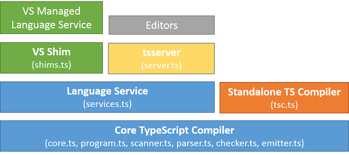

import { Head, Image } from 'mdx-deck'
import { SplitRight } from 'mdx-deck/layouts'
import Code from './Code';

export { default as theme } from './theme'

<Head>
  <title>Hello TypeScript!</title>
</Head>


# Hello TypeScript!

---


---

## What is TypeScript?

*[..], it basically formalizes a **static type system** that describes JavaScript's dynamic types, but it describes them **at development time**.*

*- Anders Hejlsberg*

---

## Why should I care? 🤷‍♂️

---


---

- JavaScript, built for scale™️ (documentation)
- Static types helps catch mistakes & bugs earlier
- Refactor with confidence
- Works well with existing projects
- Compiles to idiomatic JavaScript
- Supports ECMAScript Stage 3

```notes
- Configuration (strictness, target, non-nullable check, ...)
- Tooling (Intellisense, auto import, ...)
- Reafactoring (rename, extract function, ...)
- non-nullable type checking
- JSX support
```

---

## Type System

---

<Code
  title="Type System"
  code={require("!raw-loader!./demo/type-system.ts")}
  steps={[
    { lines: [1] },
    { tokens: { 1: [2, 4] } },
    { range: [3, 5] },
    { tokens: { 3: [5, 6, 8] } },
    { range: [7, 9] },
    { tokens: { 7: [3, 4, 5, 8, 10] } },
    { range: [11, 18] },
    { range: [20, 22] },
  ]}
/>

---


---


---

- Object- **and** Functional-orineted
- Structural Typing (unsound)
- Extensive Type Inference
- Control Flow based Type Analysis

---

<Code
  title="Structural Typing"
  code={require("!raw-loader!./demo/structural-typing.ts")}
  steps={[
    { range: [1, 10] },
    { range: [12, 20] },
  ]}
/>

---

<Code
  title="Extensive Type Inference"
  code={require("!raw-loader!./demo/type-inference.ts")}
  steps={[
    { range: [1, 4] },
    { lines: [5] },
    { range: [7, 10] },
    { range: [12, 15] },
  ]}
/>

---

### Example: "JSONified"

---

<Code
  title="Control Flow Analysis"
  code={require("!raw-loader!./demo/control-flow.ts")}
  steps={[
    { lines: [1] },
    { tokens: { 1: [4] } },
    { tokens: { 1: [6] } },
    { tokens: { 1: [8, 9, 10, 11] } },
    { tokens: { 1: [15, 16, 17, 18, 19, 20, 21] } },
    { range: [2, 4] },
    { range: [6, 8] },
    { lines: [10] },
  ]}
/>

---


---

<Code
  title="'Stringly-typed' APIs"
  code={require("!raw-loader!./demo/emitter.ts")}
  steps={[
    { range: [7, 10] },
    { range: [13, 16] },
    { range: [19, 21] },
    { range: [23, 24] },
    { range: [26, 27] },
    { range: [29, 30] },
    { range: [32, 33] },
  ]}
/>

---


---

# 🛠

---

# @types

---

export default SplitRight


---



```notes
  tsserver (node.js) <-> Editor / TypeScript Plugin -> Language Service
```

---

<Image src='assets/js-check.jpg' />

```notes
Source: https://twitter.com/housecor/status/998966257234870272
```

---


---


---

# 🍑

---

- Learning curve
- Have to know JavaScript
- **NOT** Java/C#
- Typings can be 💩

```notes
- Has a learninv curve
- **NOT** Java/C# (JS knowledge still required)
- Typings can be 💩
- Some(times) extra work for building
- Sometimes a lot of churn (too complex types, too much generics)
```

---


---


---

## 📚📚📚

- https://basarat.gitbooks.io/typescript/content/
- https://www.typescriptlang.org/docs/home.html
- https://stackoverflow.com/questions/tagged/typescript
- https://github.com/Microsoft/TypeScript
- Ask a colleague!

---

# Thank you!

## 👏

https://git.rsvx.it/sebastian.sebald/hello-typescript